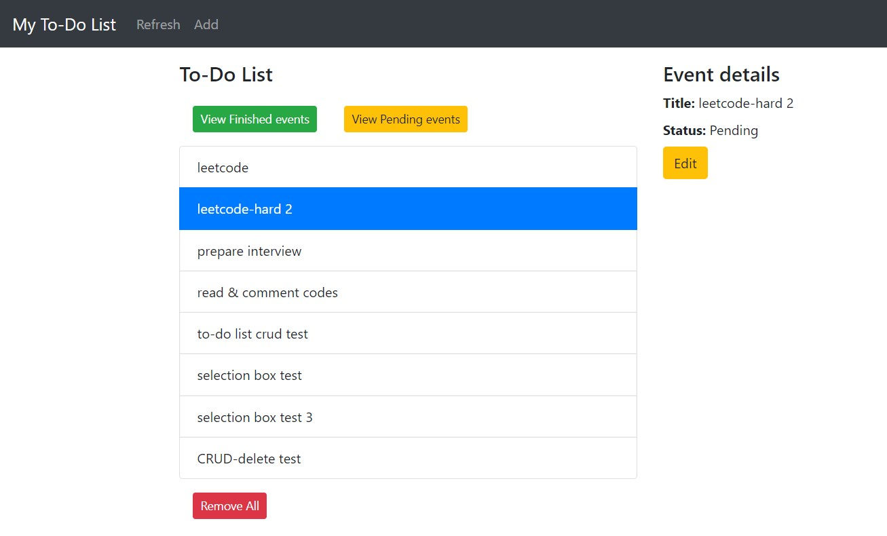
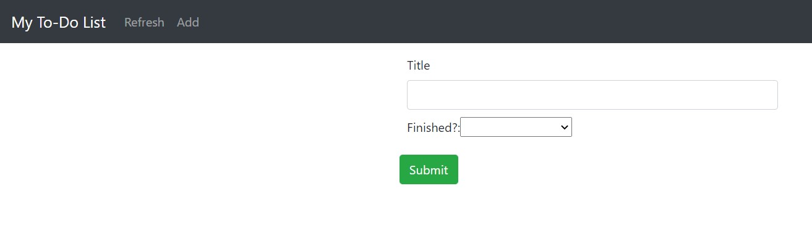
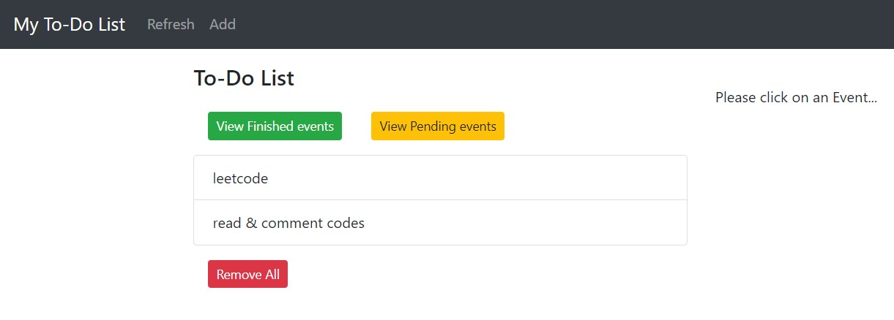
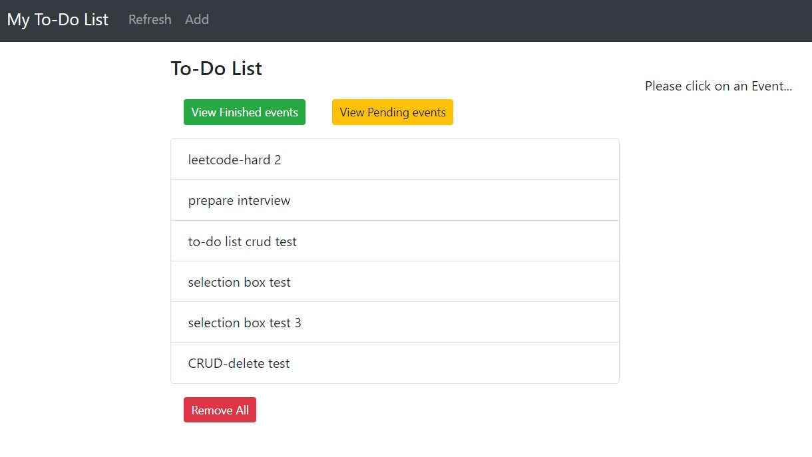
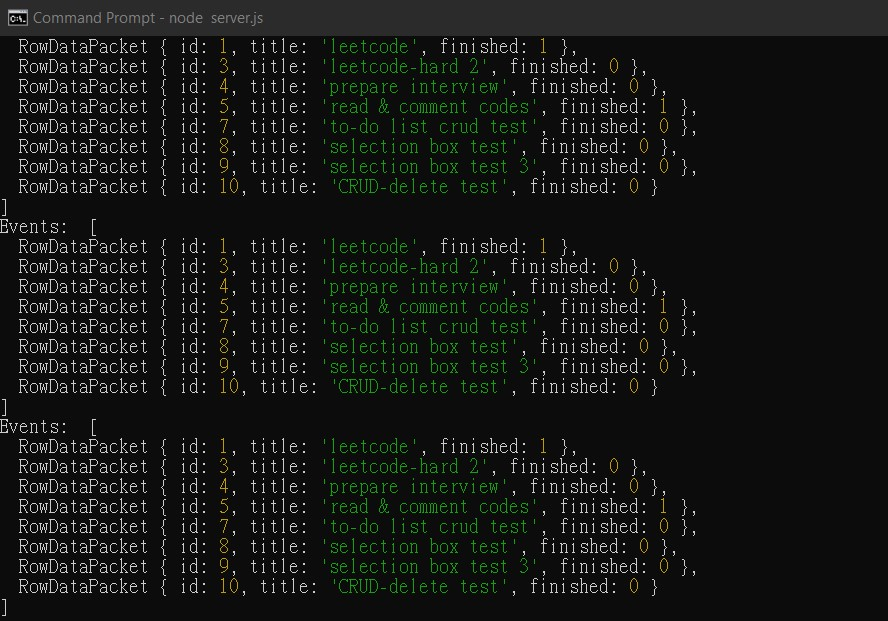

# ToDo-List-App2

### MySQL database setup
1. Create a database with the following parameters
    
    HOST: *localhost*,
    
    USER: *test-user*,
    
    PASSWORD: *123456789*,
    
    DB: *node-express*
    
    OR change the settings in **db.config.js** into your database settings
    
2. Run sql statment in SQL-script to create a list table

### Start the Node.js Express server
1. Run `cd node-express-mysql`
2. Run `node server.js`
3. Server will then listen on port 8080 and show a message that it is successfully connected to the database
4. You may then access the API with http://localhost:8080/api/events and interact with HTTP methods

### Start Vue.js frontend
1. Run `cd vue-crud`
2. Run `npm run serve`
3. Visit app with http://localhost:8081

**Index page**

**Add an event**

**Finished events**

**Pending events**

**Server running**

### Bugs:
1. After clicking **View Pending events** or **View Finished events** buttons, **Refresh** button is freezed. 
    
    Non-functional solution: Click **Add** button and then click **Refresh** button.

### Referecens:
    
https://www.bezkoder.com/vue-3-crud/
    
https://www.bezkoder.com/node-js-rest-api-express-mysql/
